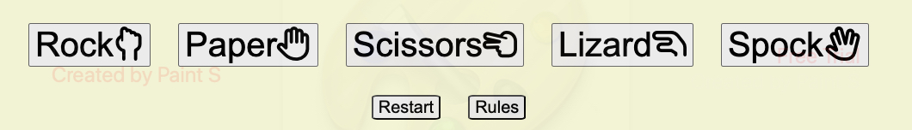
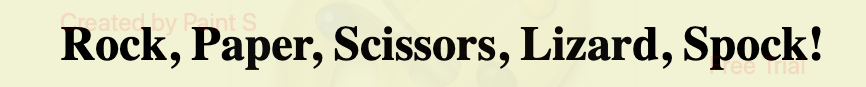
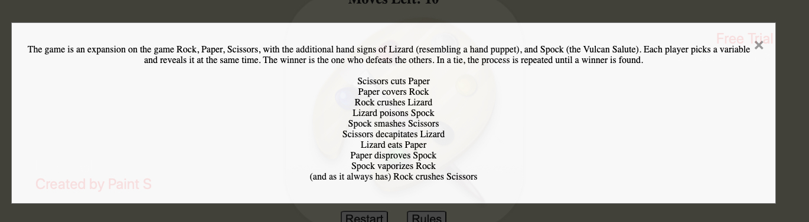
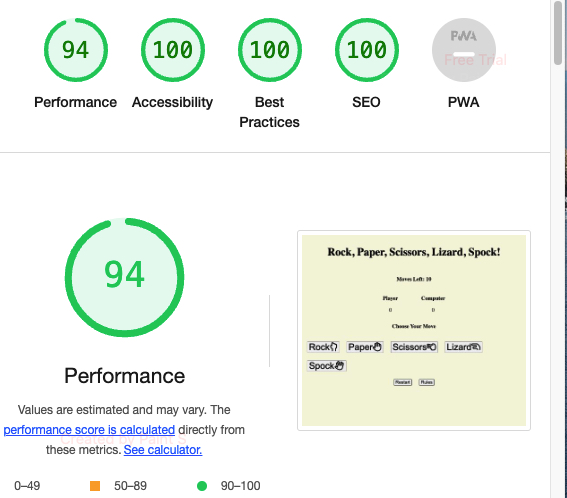

## Rock, Paper, Scissors, Lizard, Spock!

This is a game's website based on the well known game; Rock, Paper, Scissors, with a twist created from the tv series 'The Big Bang Theory'. 

People who use this website will endure a game against the computer which can result in a win, loss or tie. The player can select which move they would like to make and the computer will choose a random selection to challenge the player.

.jpg)

# Features

- Game Buttons
 - Action buttons for the players choice of move.
 - Rules button with a pop up modal to explain which move will beat other moves.
 - Restart button to replay the game once finished

- Game Area
 - Moves left function to inform the player how many turns are left of the game.
 - Score to inform the player on how many points the player and the computer have.
 - Choose move heading to promt the player into making a selction of the action buttons.

- Heading
 - Name of the game in bold text.

- Rules
 - A pop up modal to describe the rules to the player (based on the TV series 'The Big Bang Theory')

# Testing 

- I tested the website works in different browsers: Chrome, Safari.
- I tested that the website is responsize, has a good look and is easy readable on all devices using the devtools device.
- I tested the interactive game for wins, draws and losses and the correct result is shown.
- I tested the restart button works at the end of the game.
- I tested the action buttons all work when promted.

## Bugs 

- No bugs were found when validating.

## Validator Testing 

- JavaScript
 - No errors returned when passsing through JSHint, only missing semi-colons which have been put into place.

 - CSS
  - No errors returned when passing through the official W3C CSS validator.

- HTML
 - No errors returned when passing through the official W3C validator.

## Unfixed Bugs 

- There are no unfixed bugs.
